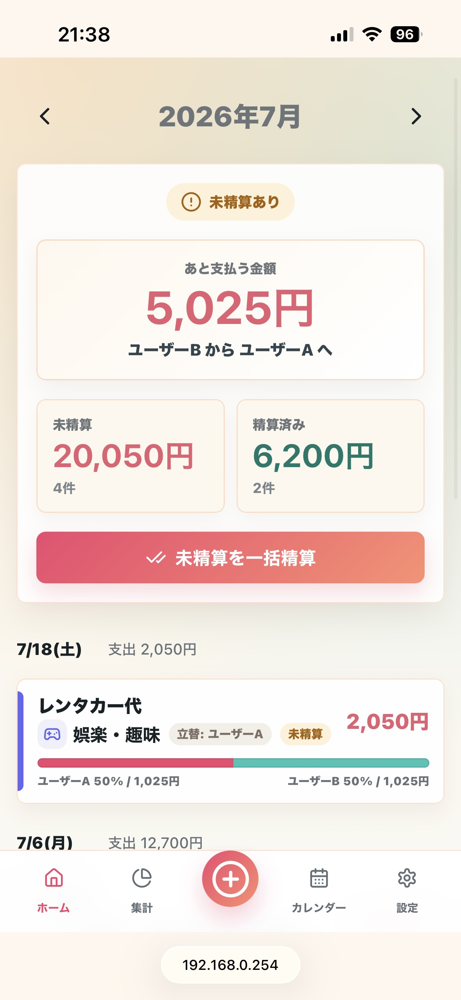
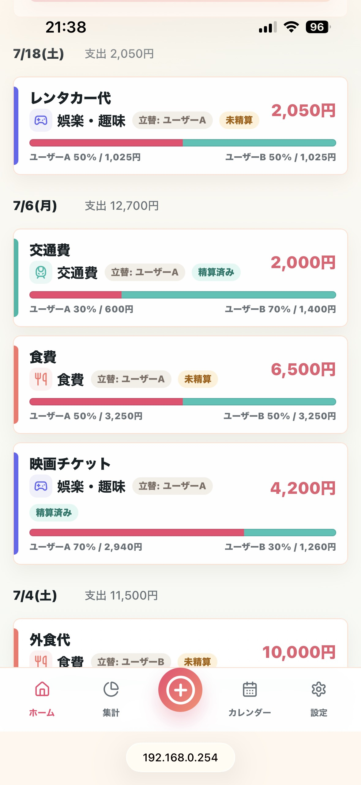
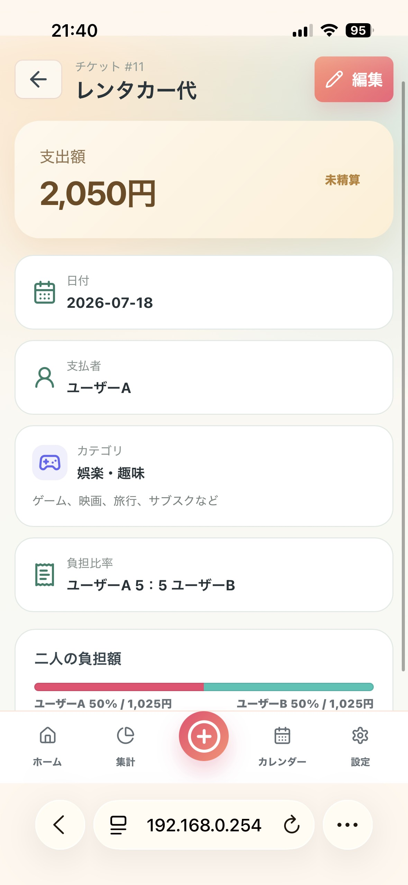
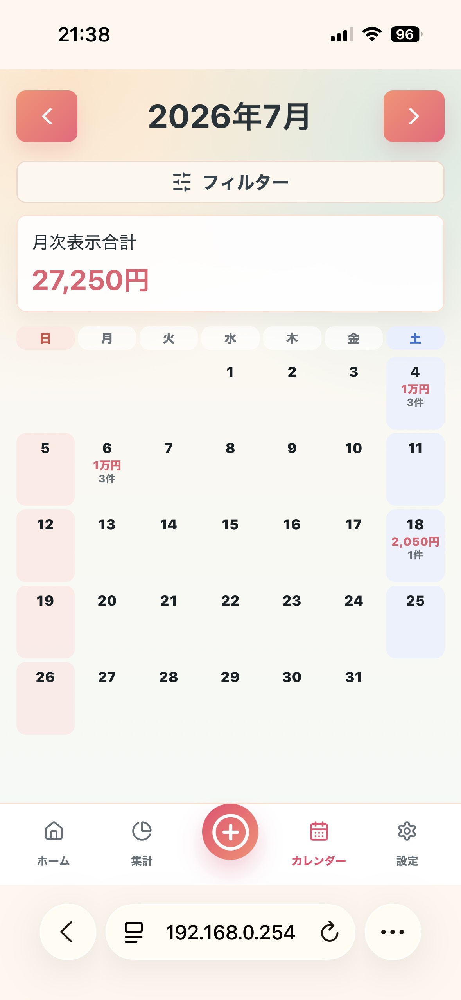
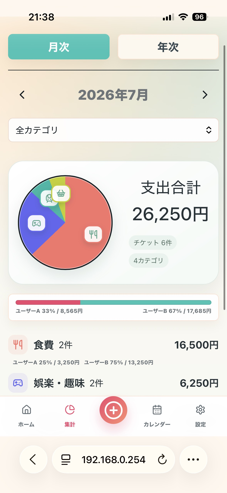
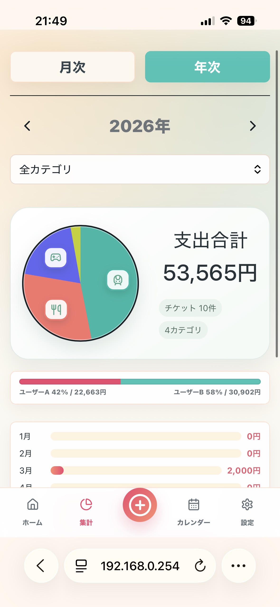
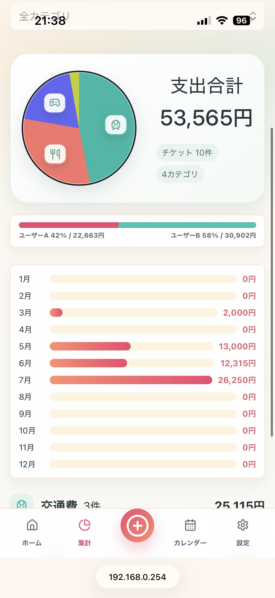
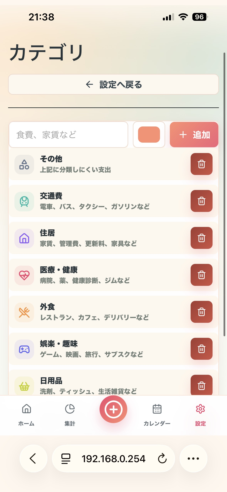

# Household Ledger

スマートフォンブラウザ向けの共有家計簿Webアプリ

## 画面イメージ

<div align="center">
  <table>
    <tr>
      <td align="center" valign="top">
        <br>
        <sub>ホーム（精算状況）</sub>
      </td>
      <td align="center" valign="top">
        <br>
        <sub>ホーム（チケット明細）</sub>
      </td>
      <td align="center" valign="top">
        <br>
        <sub>チケット参照</sub>
      </td>
      <td align="center" valign="top">
        <br>
        <sub>カレンダー</sub>
      </td>
    </tr>
    <tr>
      <td align="center" valign="top">
        <br>
        <sub>集計（月次）</sub>
      </td>
      <td align="center" valign="top">
        <br>
        <sub>集計（年次）</sub>
      </td>
      <td align="center" valign="top">
        <br>
        <sub>集計（年次）</sub>
      </td>
      <td align="center" valign="top">
        <br>
        <sub>カテゴリ設定</sub>
      </td>
      <td></td>
    </tr>
  </table>
</div>

## 概要

Household Ledgerは、支払い・負担割合・精算額をチケット単位で管理する家計簿アプリ

ローカル開発では Docker Compose + DynamoDB Local を使い、AWSでは CloudFront / S3 / API Gateway / Lambda / DynamoDB による低コストなサーバレス構成で動作

## 主な機能

- 2ユーザー用ログイン
- チケットの作成、参照、編集、複製、削除
- 未精算、精算済み、取り消しのステータス管理
- 支払者と負担比率による自動精算計算
- アイコン付き標準カテゴリ、ユーザーカテゴリ管理
- テンプレート管理
- 月次、年次カレンダー集計
- 月次メモ
- 締め日設定
- 操作履歴
- スマートフォン向けUI

## AWS構成図


## インフラ構成

AWSでは以下の構成で動作

```text
Browser / Smartphone
  |
  v
CloudFront
  |-- /*      -> S3 private bucket, React/Vite static files
  |-- /api/*  -> API Gateway HTTP API
                   |
                   v
                 Lambda Docker Image
                   |
                   |-- DynamoDB single table
                   `-- SSM Parameter Store SecureString
```

コストカットを重視して、独自ドメインを使わず、CloudFrontのデフォルトドメインで公開する前提

```text
https://xxxxxxxxxxxxx.cloudfront.net
```

## ソフトウェアスタック

### フロントエンド

- React
- TypeScript
- Vite
- lucide-react
- CSS

### バックエンド

- Python 3.12
- FastAPI
- Mangum
- boto3
- DynamoDB

### インフラ

- AWS CDK v2
- Amazon CloudFront
- Amazon S3
- Amazon API Gateway HTTP API
- AWS Lambda container image
- Amazon DynamoDB
- AWS Systems Manager Parameter Store
- Amazon CloudWatch Logs
- Amazon ECR

### ローカル開発

- Docker Compose
- DynamoDB Local

## ディレクトリ構造

```text
household-budget-app/
|-- backend/
|   |-- app/
|   |   |-- core/              # 設定、セキュリティ関連
|   |   |-- routers/           # FastAPIのAPIルーター
|   |   |-- schemas/           # Pydanticスキーマ
|   |   |-- lambda_handler.py  # Lambda用エントリポイント
|   |   |-- main.py            # FastAPIアプリ本体
|   |   `-- store.py           # DynamoDBアクセス層
|   |-- Dockerfile             # ローカル起動用
|   |-- Dockerfile.lambda      # Lambdaコンテナ用
|   `-- pyproject.toml
|-- frontend/
|   |-- src/
|   |   |-- api/               # APIクライアント
|   |   |-- components/        # 共通UIコンポーネント
|   |   |-- pages/             # 画面単位のコンポーネント
|   |   |-- styles/            # CSS
|   |   |-- types.ts
|   |   `-- main.tsx
|   |-- index.html
|   |-- package.json
|   `-- vite.config.ts
|-- infra/
|   |-- bin/                  # CDKアプリのエントリポイント
|   |-- lib/                  # CDKスタック定義
|   |-- cdk.json
|   `-- package.json
|-- docs/
|   `-- aws-architecture.svg
|-- docker-compose.yml
|-- .env.example
`-- README.md
```

## データ構成

DynamoDBの単一テーブルを利用

テーブル名:

```text
household-budget-app
```

キー構成:

```text
pk: string
sk: string
```

保存する主なエンティティ:

- `USER`
- `TICKET`
- `CATEGORY`
- `TEMPLATE`
- `SETTING`
- `MONTHLY`
- `AUDIT`

このアプリは2人利用のMVPであるため、DynamoDBの設計はシンプルに
利用量が増える場合は、GSI追加やアクセスパターンごとのキー設計見直しを検討する必要あり

## ローカル起動手順

### 前提

- Docker Desktop
- Node.js
- npm

### 起動

プロジェクト直下で実行

```powershell
cd household-budget-app
docker compose up --build
```

起動後のURL:

```text
Frontend:       http://localhost:3000
Backend API:    http://localhost:8000
DynamoDB Local: http://localhost:8001
```

### 初期ユーザー

```text
f@example.com / password
o@example.com / password
```

初期値は環境変数で変更可能

```text
INITIAL_USER_PASSWORD
INITIAL_USER_1_NAME
INITIAL_USER_2_NAME
```

表示名はログイン後に「設定」画面から変更可能

## AWSデプロイ手順

### 作成されるAWSリソース

CDKで以下を作成

- S3 private bucket
- CloudFront distribution
- API Gateway HTTP API
- Lambda Docker image function
- DynamoDB single table
- SSM Parameter Store SecureString
- CloudWatch Logs log group
- IAM roles and policies

### 前提

- AWS CLI設定済み
- Docker Desktop起動済み
- Node.js / npm
- CDKを実行できるAWS権限

個人利用や初回検証では、`AdministratorAccess` を持つIAMユーザーでもデプロイ可能


### AWS CLIの設定

例:

```powershell
aws configure --profile household-admin
```

リージョン:

```text
ap-northeast-1
```

認証確認:

```powershell
aws sts get-caller-identity --profile household-admin
```

### CDK依存関係のインストール

```powershell
cd household-budget-app\infra
npm install
```

### コマンド実行環境

このREADMEの主なコマンド例は、Windows PowerShellを前提にしている。

PowerShell固有の例:

- `Remove-Item -Recurse -Force ...`
- `$sessionSecret = "..."`
- `npx.cmd ...`
- `cd ..\frontend` のようなバックスラッシュ区切り

Linux / macOS / WSL からもデプロイ可能。
ただし、同等のシェルコマンドに読み替える必要がある。

| 用途 | PowerShell | Linux / macOS / WSL |
|---|---|---|
| ディレクトリ削除 | `Remove-Item -Recurse -Force .\dist-cdk` | `rm -rf ./dist-cdk` |
| 変数定義 | `$sessionSecret = "..."` | `sessionSecret="..."` |
| npx実行 | `npx.cmd cdk deploy` | `npx cdk deploy` |
| パス区切り | `..\frontend` | `../frontend` |

Linux / macOS / WSLでの例:

```bash
cd household-budget-app/frontend
rm -rf ./dist-cdk
npx vite build --outDir dist-cdk --emptyOutDir true

aws ssm put-parameter \
  --profile household-admin \
  --region ap-northeast-1 \
  --name "/household-ledger/initial-user-password" \
  --type SecureString \
  --value "任意のPWを指定" \
  --overwrite

cd ../infra
sessionSecret="replace-with-long-random-session-secret"
npx cdk deploy --profile household-admin -c sessionSecret="$sessionSecret"
```

制約:

- LambdaをDockerイメージとしてデプロイするため、デプロイを実行する端末でDockerが動いている必要がある。
- WindowsならDocker Desktop、LinuxならDocker Engineなどを利用する。
- AWS CLIの認証プロファイル、Node.js、npm、Docker、CDK依存関係が入っていれば、Windows以外からでもデプロイできる。

### CDK bootstrap

AWSアカウントとリージョンごとに初回のみ実行

```powershell
npx.cmd cdk bootstrap --profile household-admin
```

CDK bootstrapにより、デプロイ用のS3バケット、ECRリポジトリ、IAMロールなどが作成される

### フロントエンドのビルド

```powershell
cd ..\frontend
Remove-Item -Recurse -Force .\dist-cdk -ErrorAction SilentlyContinue
npx.cmd vite build --outDir dist-cdk --emptyOutDir true
```

CDKは `frontend/dist-cdk` の内容をS3へアップロードする。
フロントエンド変更が反映されない場合は、古い `dist-cdk` が残っている、またはビルドが最後まで完了していない可能性がある。

ビルド成功時は、最後に以下のような表示が出る。

```text
rendering chunks...
computing gzip size...
✓ built in ...
```

`✓ 1598 modules transformed.` のような表示だけで終わった場合は、まだビルド成果物が更新されていない可能性がある。
その場合は `dist-cdk` を削除して、もう一度ビルドする。

変更した文言がビルド成果物に含まれているか確認する例:

```powershell
Select-String -Path .\dist-cdk\assets\*.js -Pattern "技術詳細を見る"
```

### CDKデプロイ

初期ログインパスワードはLambda環境変数ではなく、SSM Parameter StoreのSecureStringに保存する。
CDKデプロイ前に作成または更新しておく。

```powershell
$initialUserPassword = "任意のPWを指定　※ログイン用パスワードを何にするか"

aws ssm put-parameter `
  --profile household-admin `
  --region ap-northeast-1 `
  --name "/household-ledger/initial-user-password" `
  --type SecureString `
  --value "$initialUserPassword" `
  --overwrite
```

```powershell
cd ..\infra
$sessionSecret = "replace-with-long-random-session-secret"

npx.cmd cdk deploy --profile household-admin -c sessionSecret="$sessionSecret"
```

デプロイ完了後、以下が出力される

```text
CloudFrontUrl
HttpApiUrl
DynamoDbTableName
InitialUserPasswordParameterName
```

通常利用するURLは `CloudFrontUrl` 

AWSデプロイ後の初期ログイン:

```text
f@example.com / SSM Parameter Storeに登録した値
o@example.com / SSM Parameter Storeに登録した値
```

## 更新デプロイ

### フロントエンドを変更した場合

```powershell
cd household-budget-app\frontend
Remove-Item -Recurse -Force .\dist-cdk -ErrorAction SilentlyContinue
npx.cmd vite build --outDir dist-cdk --emptyOutDir true
Select-String -Path .\dist-cdk\assets\*.js -Pattern "変更した文言"

cd ..\infra
npx.cmd cdk deploy --profile household-admin -c sessionSecret="前回と同じ値"
```

`HouseholdBudgetStack (no changes)` と表示された場合、AWS側へアップロードする差分がCDKに検出されていない状態。
フロントエンドを変更したのにこの表示になる場合は、`frontend/dist-cdk` に変更が反映されているか確認する。

CloudFrontのキャッシュが残っている場合もあるため、デプロイ後はブラウザの再読み込み、またはシークレットモードで確認する。

### バックエンドまたはインフラを変更した場合

```powershell
cd household-budget-app\infra
npx.cmd cdk deploy --profile household-admin -c sessionSecret="前回と同じ値"
```

Lambdaはコンテナイメージとしてデプロイされるため、CDKデプロイ時はローカルPCでDocker Desktopを起動しておく必要がある。
デプロイ後のLambda実行時には、ローカルPCのDocker Desktopは不要。

初期ログインパスワードを変更したい場合は、SSM Parameter StoreのSecureStringを更新する。
このアプリは起動時にSSMの値を読み、初期ユーザーのパスワードハッシュをDynamoDBへ保存する。
そのため、SSM更新後はLambdaの新しい実行環境が起動したタイミング、またはバックエンド再デプロイ後に反映される。

## CDKの中で行っていること

CDK関連の主なファイル:

```text
infra/
|-- bin/
|   `-- household-budget.ts
|-- lib/
|   `-- household-budget-stack.ts
|-- cdk.json
`-- package.json
```

### infra/cdk.json

CDK CLIがどのTypeScriptファイルを起動するかを定義している。

```json
{
  "app": "npx ts-node --prefer-ts-exts bin/household-budget.ts"
}
```

`npx cdk deploy` を実行すると、まず `bin/household-budget.ts` が読み込まれる。

### infra/bin/household-budget.ts

CDKアプリの入口。
ここで `HouseholdBudgetStack` を作成している。

```ts
new HouseholdBudgetStack(app, "HouseholdBudgetStack", {
  env: {
    account: process.env.CDK_DEFAULT_ACCOUNT,
    region: process.env.CDK_DEFAULT_REGION || "ap-northeast-1"
  }
});
```

`--profile household-admin` で指定したAWS認証情報から、デプロイ先アカウントとリージョンが決まる。

### infra/lib/household-budget-stack.ts

AWSリソースの定義本体。
主に以下を作成する。

- DynamoDB table
- SSM Parameter Store SecureString参照
- Lambda Docker image function
- API Gateway HTTP API
- S3 bucket
- CloudFront distribution
- CloudWatch Logs
- Lambda用IAM権限
- S3へのフロントエンド成果物アップロード

処理の流れ:

```text
1. DynamoDBテーブルを作成
2. Lambda用ロググループを作成
3. backend/Dockerfile.lambda からLambda用Dockerイメージをビルド
4. LambdaにDynamoDB読み書き権限を付与
5. LambdaにSSM Parameter Storeの初期ログインパスワード読み取り権限を付与
6. API Gateway HTTP APIを作成し、Lambdaへ接続
7. React/Vite成果物を置く非公開S3バケットを作成
8. CloudFrontを作成
9. CloudFrontの通常アクセスはS3へ転送
10. CloudFrontの /api/* はAPI Gatewayへ転送
11. frontend/dist-cdk をS3へアップロード
12. CloudFrontキャッシュを削除
13. CloudFrontUrl / HttpApiUrl / DynamoDbTableName / InitialUserPasswordParameterName を出力
```

Lambdaの環境変数もここで設定している。
ログインパスワードの値そのものは環境変数に入れず、SSMパラメータ名だけを渡す。

```ts
SESSION_SECRET: this.node.tryGetContext("sessionSecret") || "change-me-after-deploy",
INITIAL_USER_PASSWORD_PARAMETER_NAME: "/household-ledger/initial-user-password"
```

Lambda実行ロールには、対象SSMパラメータへの `ssm:GetParameter` 権限を付与する。
そのため、CDKデプロイ前に以下のようにSecureStringを作成しておく。

```powershell
aws ssm put-parameter --name "/household-ledger/initial-user-password" --type SecureString --value "..." --overwrite
```

CDKデプロイ時は、必要に応じてセッション秘密鍵やSSMパラメータ名を `-c` で渡す。

```powershell
npx.cmd cdk deploy -c sessionSecret="..." -c initialUserPasswordParameterName="/household-ledger/initial-user-password"
```

### backend/Dockerfile.lambda

Lambdaコンテナイメージの作り方を定義している。
CDKはこのDockerfileを使ってバックエンドをビルドし、ECRへpushしてLambdaに設定する。

### frontend/dist-cdk

CDKがS3へアップロードするフロントエンドのビルド成果物。
フロントエンドを変更しただけの場合でも、必ず `frontend/dist-cdk` を作り直してから `cdk deploy` する。

## インフラ設計メモ

- CloudFrontが公開入口
- CloudFrontは `/api/*` をAPI Gatewayへ転送
- CloudFrontはそれ以外のパスをS3の静的ファイルへ転送
- S3バケットは非公開
- API GatewayはLambda proxy integrationを利用
- Lambda上でFastAPIをMangum経由で実行
- DynamoDBはオンデマンド課金
- 初期ログインパスワードはSSM Parameter StoreのSecureStringで管理
- Lambda環境変数にはパスワード値を置かず、SSMパラメータ名のみを設定
- CloudWatch Logsの保持期間は7日
- DynamoDBテーブルとS3バケットは誤削除防止のため `RETAIN` に

## コストメモ

低頻度利用を前提に、固定費ができるだけ小さくなる構成
現在はCloudFrontのデフォルトドメインを使うため、独自ドメイン費用もかからない
１日１回程度のアクセスであれば、月1$もかからないコスト感

## クリーンアップ

CDKスタックを削除する場合:

```powershell
cd household-budget-app\infra
npx cdk destroy --profile household-admin
```

注意:

- DynamoDBテーブルは保持される
- S3バケットは保持される
- 完全に削除したい場合は、保持されたリソースをAWSコンソール等から手動削除が必要
