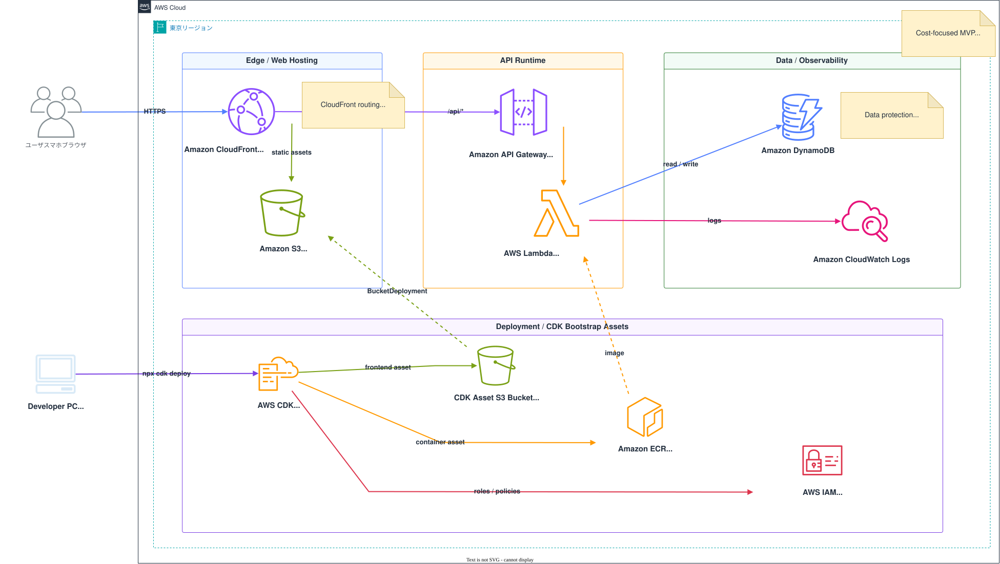

# Household Ledger

スマートフォンブラウザ向けの共有家計簿Webアプリです。

## AWS構成図



## 概要

Household Ledgerは、支払い・負担割合・精算額をチケット単位で管理する家計簿アプリです。

ローカル開発では Docker Compose + DynamoDB Local を使い、AWSでは CloudFront / S3 / API Gateway / Lambda / DynamoDB による低コストなサーバレス構成で動作します。

## 主な機能

- 2ユーザー用ログイン
- チケットの作成、編集、複製、削除
- 未精算、精算済み、取り消しのステータス管理
- 支払者と負担比率による自動精算計算
- カテゴリ管理
- テンプレート管理
- 月次、年次カレンダー集計
- 月次精算メモ
- 締め日設定
- 操作履歴
- スマートフォン向けUI

## インフラ構成

AWSでは以下の構成で動作します。

```text
Browser / Smartphone
  |
  v
CloudFront
  |-- /*      -> S3 private bucket, React/Vite static files
  |-- /api/*  -> API Gateway HTTP API
                   |
                   v
                 Lambda Docker Image
                   |
                   v
                 DynamoDB single table
```

コストカットを重視して、独自ドメインを使わず、CloudFrontのデフォルトドメインで公開する前提。

```text
https://xxxxxxxxxxxxx.cloudfront.net
```

## ソフトウェアスタック

### フロントエンド

- React
- TypeScript
- Vite
- lucide-react
- CSS

### バックエンド

- Python 3.12
- FastAPI
- Mangum
- boto3
- DynamoDB

### インフラ

- AWS CDK v2
- Amazon CloudFront
- Amazon S3
- Amazon API Gateway HTTP API
- AWS Lambda container image
- Amazon DynamoDB
- Amazon CloudWatch Logs
- Amazon ECR

### ローカル開発

- Docker Compose
- DynamoDB Local

## ディレクトリ構造

```text
household-budget-app/
|-- backend/
|   |-- app/
|   |   |-- core/              # 設定、セキュリティ関連
|   |   |-- routers/           # FastAPIのAPIルーター
|   |   |-- schemas/           # Pydanticスキーマ
|   |   |-- lambda_handler.py  # Lambda用エントリポイント
|   |   |-- main.py            # FastAPIアプリ本体
|   |   `-- store.py           # DynamoDBアクセス層
|   |-- Dockerfile             # ローカル起動用
|   |-- Dockerfile.lambda      # Lambdaコンテナ用
|   `-- pyproject.toml
|-- frontend/
|   |-- src/
|   |   |-- api/               # APIクライアント
|   |   |-- components/        # 共通UIコンポーネント
|   |   |-- pages/             # 画面単位のコンポーネント
|   |   |-- styles/            # CSS
|   |   |-- types.ts
|   |   `-- main.tsx
|   |-- index.html
|   |-- package.json
|   `-- vite.config.ts
|-- infra/
|   |-- bin/                  # CDKアプリのエントリポイント
|   |-- lib/                  # CDKスタック定義
|   |-- cdk.json
|   `-- package.json
|-- docs/
|   `-- aws-architecture.svg
|-- docker-compose.yml
|-- .env.example
`-- README.md
```

## データ構成

DynamoDBの単一テーブルを利用します。

テーブル名:

```text
household-budget-app
```

キー構成:

```text
pk: string
sk: string
```

保存する主なエンティティ:

- `USER`
- `TICKET`
- `CATEGORY`
- `TEMPLATE`
- `SETTING`
- `MONTHLY`
- `AUDIT`

このアプリは2人利用のMVPであるため、DynamoDBの設計はシンプルにしています。利用量が増える場合は、GSI追加やアクセスパターンごとのキー設計見直しを検討する必要あり。

## ローカル起動手順

### 前提

- Docker Desktop
- Node.js
- npm

### 起動

プロジェクト直下で実行します。

```powershell
cd household-budget-app
docker compose up --build
```

起動後のURL:

```text
Frontend:       http://localhost:3000
Backend API:    http://localhost:8000
DynamoDB Local: http://localhost:8001
```

### 初期ユーザー

```text
f@example.com / password
o@example.com / password
```

初期値は環境変数で変更できます。

```text
INITIAL_USER_PASSWORD
INITIAL_USER_1_NAME
INITIAL_USER_2_NAME
```

表示名はログイン後に「設定」画面から変更できます。

## AWSデプロイ手順

### 作成されるAWSリソース

CDKで以下を作成します。

- S3 private bucket
- CloudFront distribution
- API Gateway HTTP API
- Lambda Docker image function
- DynamoDB single table
- CloudWatch Logs log group
- IAM roles and policies

### 前提

- AWS CLI設定済み
- Docker Desktop起動済み
- Node.js / npm
- CDKを実行できるAWS権限

個人利用や初回検証では、`AdministratorAccess` を持つIAMユーザーでもデプロイできます。長期運用では、より狭い権限のデプロイ用ロールやIAM Identity Centerの利用を検討してください。

AWSアクセスキー、パスワード、シークレット値はGitHubにコミットしないでください。

### AWS CLIの設定

例:

```powershell
aws configure --profile household-admin
```

リージョン:

```text
ap-northeast-1
```

認証確認:

```powershell
aws sts get-caller-identity --profile household-admin
```

### CDK依存関係のインストール

```powershell
cd household-budget-app\infra
npm install
```

### CDK bootstrap

AWSアカウントとリージョンごとに初回のみ実行します。

```powershell
npx.cmd cdk bootstrap --profile household-admin
```

CDK bootstrapにより、デプロイ用のS3バケット、ECRリポジトリ、IAMロールなどが作成されます。

### フロントエンドのビルド

```powershell
cd ..\frontend
npx.cmd vite build --outDir dist-cdk --emptyOutDir true
```

CDKは `frontend/dist-cdk` の内容をS3へアップロードします。

### CDKデプロイ

```powershell
cd ..\infra
$sessionSecret = "Qm8vK4xYp9rT2nL6sD7fGhJ3kWz1cXa5PbR0uIeYqMNsVt84"
$initialUserPassword = "任意のPWを指定　※ログイン用パスワードを何にするか"

npx.cmd cdk deploy --profile household-admin -c sessionSecret="$sessionSecret" -c initialUserPassword="$initialUserPassword"
```

デプロイ完了後、以下が出力される。

```text
CloudFrontUrl
HttpApiUrl
DynamoDbTableName
```

通常利用するURLは `CloudFrontUrl` です。

AWSデプロイ後の初期ログイン:

```text
f@example.com / initialUserPasswordで指定した値
o@example.com / initialUserPasswordで指定した値
```

## 更新デプロイ

### フロントエンドを変更した場合

```powershell
cd household-budget-app\frontend
npx vite build --outDir dist-cdk --emptyOutDir true
cd ..\infra
npx cdk deploy --profile household-admin -c sessionSecret="前回と同じ値" -c initialUserPassword="必要に応じた値"
```

### バックエンドまたはインフラを変更した場合

```powershell
cd household-budget-app\infra
npx cdk deploy --profile household-admin -c sessionSecret="前回と同じ値" -c initialUserPassword="必要に応じた値"
```

Lambdaはコンテナイメージとしてデプロイされるため、Docker Desktopを起動しておく必要があります。

## インフラ設計メモ

- CloudFrontが公開入口です。
- CloudFrontは `/api/*` をAPI Gatewayへ転送します。
- CloudFrontはそれ以外のパスをS3の静的ファイルへ転送します。
- S3バケットは非公開です。
- API GatewayはLambda proxy integrationを利用します。
- Lambda上でFastAPIをMangum経由で実行します。
- DynamoDBはオンデマンド課金です。
- CloudWatch Logsの保持期間は7日です。
- DynamoDBテーブルとS3バケットは誤削除防止のため `RETAIN` にしています。

## コストメモ

低頻度利用を前提に、固定費ができるだけ小さくなる構成です。

現在はCloudFrontのデフォルトドメインを使うため、独自ドメイン費用は不要です。

独自ドメインを追加する場合は、主に以下の費用が追加されます。

- ドメイン取得・更新費用
- Route 53 Hosted Zone費用

## クリーンアップ

CDKスタックを削除する場合:

```powershell
cd household-budget-app\infra
npx cdk destroy --profile household-admin
```

注意:

- DynamoDBテーブルは保持されます。
- S3バケットは保持されます。
- 完全に削除したい場合は、保持されたリソースをAWSコンソール等から手動削除してください。
